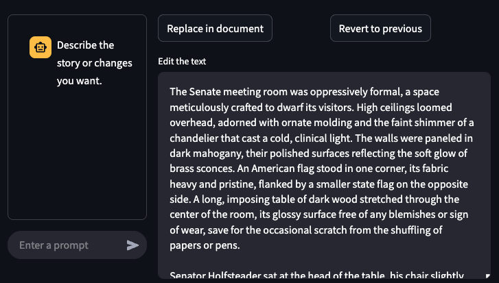
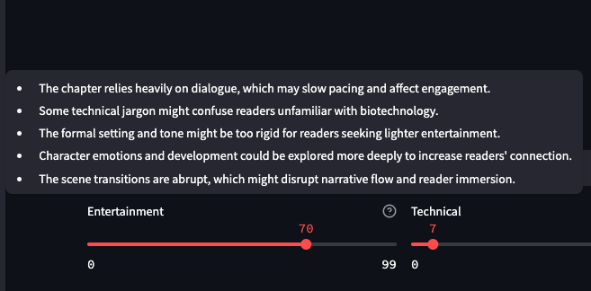
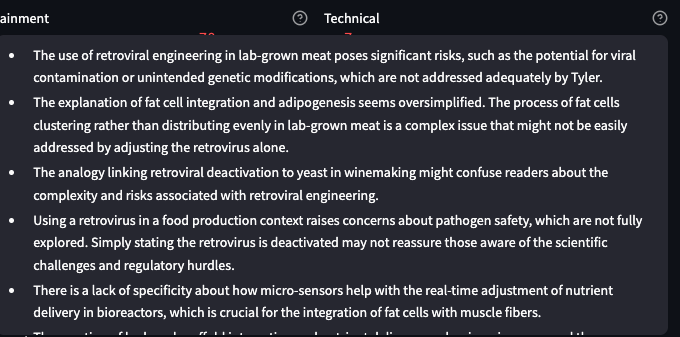

# Author Tool

## Description
A tool designed to assist authors in their writing process by leveraging LLMs and Generative AI to simplify the writing process.


With this tool, authors can leverage Generative AI to help them write.


When they are done they can replace the original section in the story with the updates.

The AI also is used to give feedback on the entertainment value and the technical accuracy of the story based on the character's knowledge in the chapter.
|||
|:--:|:--:|
|||

## Features
- LLM Supported Writing
- Technical accuracy evaluation of content in chapters based on character's expertise
- Entertainment evaluation of the content in chapters
- Summary of chapters
- Summary of characters, and which chapters they appear in
- Character images
- Customizable writing style
- Customizable LLM sources for different writing elements (content, technical evaluations, entertainment evaluations, images and voice)
- Chapter audio playback
- Supports Local LLM use

## Development

### Initialization
```bash
# Setup virtual environment
make init
source .venv/bin/activate
```

### Running the project
```bash
make run
```

### Contributing
1. Fork the repository

2. Create your feature branch
```bash
git checkout -b feature/amazing-feature
```

3. Commit your changes
```bash
git commit -m 'Add some amazing feature'
```

4. Push to the branch
```bash
git push origin feature/amazing-feature
```

5. Open a Pull Request

### Configuration

#### Settings
Settings are stored in a JSON format located at: **'.data/settings.json'**

Each usage type of the LLM is stored seperately in order to allow for specific
configurations of the same or different LLMs.

#### Books
Books are stored at: **'.data/{book name}'**

Books are a directory, with writing styles, chapters and characters stored in the folder

#### Chapters
Chapters are stored at: **'.data/{book name}/chapters/{chapter number}'**

The main content of the chapter is stored in **'content.md'**. A list of characters is stored in **'characters.md'**, a cached summary is stored in **'summary.md'**, cached entertainment and technical evaluations are stored in **'entertainment_eval.md'** and **'technical_eval.md'**. A breakdown of character summaries for the chapter are stored in **'characters/{character name}'**. and if audio is played the audio is cached per paragraph in **'audio/paragraph_{paragraph number}.mp3'**.

#### Characters
Characters information is stored at: **'.data/{book name}/characters/{character name}'**

A character description is stored in **'description.md'**. This description is then used to generate the character image, stored as **'thumbnail.png'**. 

Character expertise information is stored in **'expertise.md'**. This information is leveraged during the technical evaluation of chapters this character is in.

### License
This project is under the MIT License.

### Authors
- Nikody Keating
